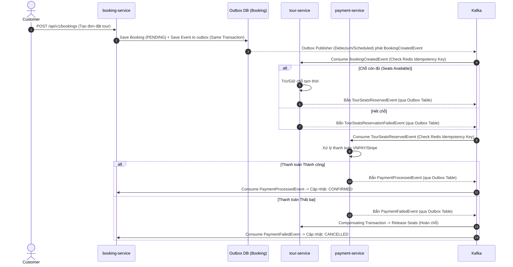

TRAVEL MICROSERVICES PLATFORM (SPRING BOOT EDITION)
Mô hình: Monorepo Maven Multi-Module, Spring Boot 3.x, Microservices Architecture, Event-Driven Choreography Saga, Shared Common Libraries (common-lib).

1. CẤU TRÚC MONOREPO & MULTI-MODULE MAVEN
Hệ thống kế thừa mô hình Maven Multi-Module Monorepo từ mẫu để quản lý dependency tập trung và tái sử dụng hạ tầng:

text
travel-microservices/
├── pom.xml                 # Root Parent POM (Quản lý version Spring Boot 3.3.x, Java 21, MapStruct)
├── Makefile                # Script tự động hóa build, test, docker-build toàn hệ thống
├── docker-compose.yml      # Local Infrastructure (PostgreSQL, Kafka, Gateway, Keycloak)
├── k3d-config.yaml         # K3s/K3d Kubernetes local cluster config
├── k3d-setup.sh            # Script setup K8s cluster
├── docs/                   # Tài liệu OpenAPI & thiết kế hệ thống
│
├── common-lib/             # Shared Libraries (Xương sống hạ tầng)
│   ├── pom.xml
│   ├── common-core/        # ApiResponse, Custom Exceptions, ViewModels, Utilities
│   ├── common-spring/      # Spring Web Beans, OpenAPI/Swagger config, CORS
│   ├── common-security/    # Spring Security JWT Token Filter & Context propagation
│   ├── common-keycloak/    # Keycloak Admin Client & Token Bridge
│   ├── common-kafka/       # Kafka Producers/Consumers, Serializer, Base Event Payload
│   ├── common-storage/     # MinIO / AWS S3 Upload SDK
│   └── common-logging/     # MDC TraceId filter, SLF4J AOP Logging Aspect
│
├── api-gateway/            # Spring Cloud Gateway / APISIX (Port 8080)
├── auth-service/           # User Management & Keycloak Authentication (Port 8081)
├── tour-service/           # Quản lý Tour, Lịch trình & Giữ chỗ (Port 8082)
├── booking-service/        # Quản lý Đơn đặt tour & Saga Event Initiator (Port 8083)
├── payment-service/        # Xử lý Thanh toán VNPAY, MOMO, Stripe (Port 8084)
├── ai-service/             # AI Tư vấn lịch trình & Chatbot - Spring AI (Port 8085)
└── frontend/               # Web Application Client (Next.js / React)
2. BOUNDED CONTEXT (DOMAIN-DRIVEN DESIGN - DDD)
1. Auth Service (auth-service)
Nhiệm vụ: Quản lý tài khoản du khách (Tourist), Hướng dẫn viên (Tour Guide), Admin. Cấp phát và xác thực JWT Token thông qua Keycloak integration (common-keycloak).
Core Aggregates: User, Role, UserProfile.
Database: db_travel_auth (PostgreSQL - Port 5432).
2. Tour Service (tour-service)
Nhiệm vụ: Quản lý danh mục tour, địa điểm đến (Destinations), lịch trình chi tiết (Itineraries), bảng giá niêm yết và số lượng chỗ còn trống (Available Seats).
Core Aggregates: Tour (Aggregate Root), Itinerary, Destination, TourSchedule.
Database: db_travel_tour (PostgreSQL - Port 5433).
3. Booking Service (booking-service)
Nhiệm vụ: Quản lý toàn bộ vòng đời đơn đặt tour (PENDING, SEATS_RESERVED, PAYMENT_PENDING, CONFIRMED, CANCELLED). Khởi xướng luồng Saga Event bất đồng bộ qua Kafka.
Core Aggregates: Booking (Aggregate Root), BookingPassenger, BookingStatus.
Database: db_travel_booking (PostgreSQL - Port 5434).
4. Payment Service (payment-service)
Nhiệm vụ: Xử lý giao dịch thanh toán tiền tour (VNPAY, MOMO, Stripe), lưu lịch sử giao dịch và tiếp nhận Webhook thanh toán.
Core Aggregates: Payment (Aggregate Root), PaymentTransaction.
Database: db_travel_payment (PostgreSQL - Port 5435).
5. AI Service (ai-service)
Nhiệm vụ: Cung cấp AI Assistant tư vấn lịch trình du lịch thông minh, tìm kiếm ngữ nghĩa (RAG) và phân tích phản hồi du khách bằng Spring AI / OpenAI API.
Core Aggregates: TripRecommendation, ChatSession.
Database: db_travel_ai (PostgreSQL + pgvector - Port 5436).
3. THƯ VIỆN CHUNG common-lib
Tất cả các microservices bắt buộc kế thừa các sub-module của common-lib thay vì viết trùng lặp code:

1. Quy mô Các Sub-module Hạ tầng:
- common-core:
  Chứa chuẩn ApiResponse<T> record, ErrorVm, các lớp Exception chuẩn (NotFoundException, BadRequestException, DuplicatedException).
  Các Helper utilities: DateTimeUtils, JsonUtils, MdcKey.
- common-security:
  Bộ Filter/Interceptor mỏng trích xuất các HTTP Headers (`X-User-Id`, `X-User-Roles`, `X-User-Email`) đã được xác thực từ API Gateway và tự động thiết lập Spring SecurityContextHolder.
- common-kafka:
  Cấu hình KafkaTemplate, @KafkaListener, Jackson Serializer/Deserializer, base class AbstractEventPayload và cơ chế **Idempotent Consumer** (xử lý trùng tin qua Redis).
- common-storage:
  Service SDK upload/download hình ảnh tour, avatar du khách lên S3 / MinIO.
- common-logging:
  MDC Filter tự động trích xuất hoặc sinh traceId truyền qua HTTP Header và Kafka Headers để truy vết log (Distributed Tracing).

2. Quy tắc Quản lý Dependency & Chống Tight Coupling (Nguy cơ Phụ thuộc Chặt):
- **Quản lý phiên bản nghiêm ngặt (Semantic Versioning):** Áp dụng Semantic Versioning (ví dụ: `1.0.0-SNAPSHOT` cho phát triển, `1.0.0`, `1.1.0` cho release) để kiểm soát thay đổi dependency.
- **Cô lập Hạ tầng (Pure Infrastructure Only):** `common-lib` CHỈ chứa code hạ tầng thuần túy (Cross-cutting concerns như response format, exception handlers, security interceptor, log tracing).
- **Tuyệt đối CẤM Business Logic:** KHÔNG đưa bất kỳ logic nghiệp vụ, Entity JPA hay DTO Domain nào (Tour, Booking, Payment) vào `common-lib`. Mỗi microservice tự làm chủ Domain Model của mình để tránh việc sửa 1 file nhỏ làm re-build và re-deploy toàn bộ 5 microservices.
4. CẤU TRÚC PACKAGE TRONG MỖI MICROSERVICE
Tất cả các Spring Boot Microservices tổ chức theo chuẩn Package-by-Layer:

text
com.travel.<servicename>/
├── config/           # Spring @Configuration Beans (Security, OpenAPI, Kafka, Async)
├── constant/         # Enums, Error Codes, Constants (UPPER_SNAKE_CASE)
├── controller/       # REST Controllers (@RestController, @RequestMapping)
├── dto/              # Request Payloads (ví dụ: CreateBookingRequest)
├── viewmodel/        # Response Payloads với hậu tố *Vm (ví dụ: TourVm, BookingVm)
├── entity/           # JPA Entities (@Entity, @Table, @Id)
├── exception/        # Custom Exceptions & Global Exception Handler (@RestControllerAdvice)
├── helper/           # Utilities bổ trợ logic nghiệp vụ
├── mapper/           # MapStruct Interfaces (Mapping Entity <-> DTO/ViewModel)
├── repository/       # Spring Data JPA Repositories (JpaRepository<Entity, ID>)
└── service/          # Business Logic Interfaces & Implementation (ServiceImpl)
5. DTO, VIEWMODEL & CHUẨN RESPONSE API
1. Chuẩn hóa Class ApiResponse<T> (Rút từ common-core)
Tất cả REST Controller đều trả về định dạng ApiResponse<T>:

java
public record ApiResponse<T>(
    boolean success,
    String code,
    String message,
    T data,
    List<String> errors,
    String path,
    String traceId,
    Instant timestamp
) {
    public static final String SUCCESS_CODE = "OK";
    public static <T> ApiResponse<T> ok(T data) {
        return new ApiResponse<>(true, SUCCESS_CODE, null, data, null, null, currentTraceId(), Instant.now());
    }
    public static <T> ApiResponse<T> ok(T data, String message) {
        return new ApiResponse<>(true, SUCCESS_CODE, message, data, null, null, currentTraceId(), Instant.now());
    }
    public static ApiResponse<Void> error(String code, String message, String path) {
        return new ApiResponse<>(false, code, message, null, null, path, currentTraceId(), Instant.now());
    }
    private static String currentTraceId() {
        return MDC.get(MdcKey.TRACE_ID);
    }
}
2. Quy ước đặt tên DTO & ViewModel
Request DTO (Dữ liệu đầu vào): [Action][Entity]Request (ví dụ: CreateBookingRequest, UpdateTourRequest).
Response ViewModel (Dữ liệu đầu ra): [Entity]Vm hoặc [Entity]DetailVm (ví dụ: TourVm, BookingVm, BookingDetailVm).
6. SAGA PATTERN & KAFKA EVENT FLOW
Ứng dụng mẫu Choreography-based Saga Pattern thông qua Spring Kafka để xử lý giao dịch phân tán:

1. Luồng Giao Dịch Saga Chính (Sequence Diagram):

2. Cơ chế Giải quyết Vấn đề Dual-Write (Transactional Outbox Pattern):
- **Vấn đề Dual-Write:** Việc ghi dữ liệu đơn hàng vào DB thành công nhưng ngay sau đó phát tin ra Kafka gặp sự cố (Kafka down/lỗi mạng) khiến tin nhắn bị mất, luồng Đặt tour bị "mắc kẹt" vĩnh viễn ở trạng thái PENDING.
- **Giải pháp Transactional Outbox Pattern:**
  - Tạo bảng `outbox` (`id`, `aggregate_type`, `aggregate_id`, `type`, `payload`, `status`, `created_at`) nằm ngay trong Database của từng Microservice (ví dụ: `db_travel_booking`).
  - Khi `booking-service` nhận request, nó lưu thông tin đơn hàng và bản tin Event vào bảng `outbox` **trong cùng 1 DB Transaction** (bảo đảm nguyên tố ACID).
  - Sử dụng một Publisher độc lập (Spring `@Scheduled` Task polling hoặc công cụ CDC như **Debezium**) đọc các record chưa gửi từ bảng `outbox`, phát lên Kafka topic và đánh dấu `PROCESSED` hoặc xóa khỏi outbox.

3. Cơ chế Xử lý Sự kiện Trùng lặp (Idempotent Consumer):
- **Vấn đề Duplicate Event:** Kafka cam kết giao tin theo cơ chế *At-least-once* (Ít nhất một lần). Do rủi ro retry hoặc mạng lag, 1 Event (như `PaymentProcessedEvent` hay `BookingCreatedEvent`) có thể bị gửi trùng 2 lần, gây nguy cơ xử lý lặp (như trừ chỗ 2 lần, confirm đơn lặp).
- **Giải pháp Idempotent Consumer (`common-kafka` & Redis):**
  - Mọi Event Payload đều chứa thuộc tính định danh duy nhất `eventId` (UUID) và `bookingId`.
  - Tích hợp bộ kiểm tra Idempotency tại `@KafkaListener` tiêu thụ tin nhắn trong `common-kafka`.
  - Trước khi xử lý logic nghiệp vụ, Consumer sử dụng `eventId` (hoặc `idempotencyKey = "event:" + eventId`) thực hiện thao tác Atomic `SETNX` (Set if Not Exists) trên **Redis** với TTL (ví dụ: 24h).
  - Nếu Key đã tồn tại (đã từng xử lý trước đó), Consumer lập tức bỏ qua (acknowledge) mà không chạy lại logic nghiệp vụ.

4. Kiến trúc RAG AI & Kafka Async Ingestion Pipeline (`ai-service`):
- **Đồng bộ Dữ liệu Bất đồng bộ qua Kafka:** Khi `tour-service` tạo/sửa Tour, Event `TourUpdatedEvent` được phát ra Kafka. `ai-service` lắng nghe Event này để tự động phân đoạn (Semantic Chunking) và tạo Vector Embedding lưu vào PostgreSQL `pgvector` (`tour_embeddings`).
- **Tối ưu HNSW Indexing:** Sử dụng chỉ mục HNSW Index (`vector_cosine_ops`) trên `pgvector` giúp truy vấn tìm kiếm tương đồng Vector Cosine đạt tốc độ siêu nhanh ($\le 10ms$).
- **Hybrid Search & Re-Ranking:** Kết hợp Dense Vector Search với Metadata Filtering (giá vé, địa điểm) và Re-Ranker để chọn ra Top 3-5 ngữ cảnh chính xác nhất.
- **Anti-Hallucination Guardrails & Semantic Caching:** Prompt Template bắt buộc AI chỉ sử dụng dữ liệu ngữ cảnh có sẵn, trả về dữ liệu cấu trúc (Structured JSON DTO `TripRecommendationVm`) kèm link đặt tour thật. Sử dụng Redis Cache lưu cặp Query Vector - Result để tiết kiệm 90% chi phí API.

7. DATABASE ISOLATION & API GATEWAY ROUTING
1. Quy tắc Cô lập Database (Database Isolation)
Mỗi microservice sở hữu cơ sở dữ liệu PostgreSQL độc lập.
CẤM HOÀN TOÀN việc JOIN cơ sở dữ liệu chéo giữa các service hoặc truy cập DB của service khác.
Lấy thông tin giữa các service phải qua REST (dùng OpenFeign) hoặc Kafka Event.

2. Định tuyến & Xác thực API Gateway (Port 8080)
- **Định tuyến Services:**
  - `/api/v1/auth/**` -> auth-service (Port 8081)
  - `/api/v1/tours/**` -> tour-service (Port 8082)
  - `/api/v1/bookings/**` -> booking-service (Port 8083)
  - `/api/v1/payments/**` -> payment-service (Port 8084)
  - `/api/v1/ai/**` -> ai-service (Port 8085)

- **Xác thực Token tập trung tại API Gateway (OAuth2 Resource Server):**
  - Cấu hình **Spring Cloud Gateway làm OAuth2 Resource Server** để kiểm tra và giải mã JWT Token (kết nối trực tiếp với Keycloak JWKS endpoint) ngay tại cửa ngõ API Gateway (Port 8080).
  - Các request có Token hết hạn / giả mạo / không hợp lệ hoặc thiếu Token sẽ bị chặn và trả về HTTP `401 Unauthorized` hoặc `403 Forbidden` ngay tại cửa ngõ, ngăn không cho đi sâu vào mạng nội bộ.
  - Khi xác thực thành công, API Gateway bóc tách thông tin người dùng từ claims và truyền xuống downstream microservices qua các Custom HTTP Headers: `X-User-Id`, `X-User-Roles`, `X-User-Email`. Các microservice phía sau sử dụng Filter mỏng từ `common-security` để tự động thiết lập Spring `SecurityContextHolder`.
8. QUY ƯỚC LẬP TRÌNH & XỬ LÝ LỖI (CODING RULES)
Giới hạn kích thước file: Mỗi file code Java KHÔNG vượt quá 250 dòng. Khi quá 250 dòng, phải tự động bóc tách Sub-service hoặc Helper class.
Global Exception Handling: Tất cả Microservices phải có lớp @RestControllerAdvice bắt ngoại lệ và trả về ApiResponse.error(...).
Bean Validation: Tất cả Request DTO phải khai báo Jakarta Validation (@NotNull, @NotBlank, @Positive, @Email). Các phương thức @RestController phải có @Valid.
Logging Standard:
Sử dụng SLF4J + Logback (@Slf4J trong Lombok).
Tuyệt đối CẤM dùng System.out.println().
Mapping Layer: Sử dụng MapStruct interface để chuyển đổi qua lại giữa Entity và DTO/ViewModel.
9. TRIỂN KHAI & DEVOPS (DOCKER / KUBERNETES)
Multi-stage Dockerfile: Mỗi microservice có Dockerfile riêng sử dụng Stage 1 (maven:3.9-eclipse-temurin-21) để build jar và Stage 2 (eclipse-temurin:21-jre-alpine) để chạy ứng dụng nhẹ nhất.
Spring Boot Actuator: Khai báo livenessProbe và readinessProbe trỏ tới /actuator/health trong Kubernetes Deployment manifests (k8s/).
Environment Variables: Cấu hình kết nối DB, Kafka, Port luôn truyền qua biến môi trường (${SPRING_DATASOURCE_URL}, ${SPRING_KAFKA_BOOTSTRAP_SERVERS}).