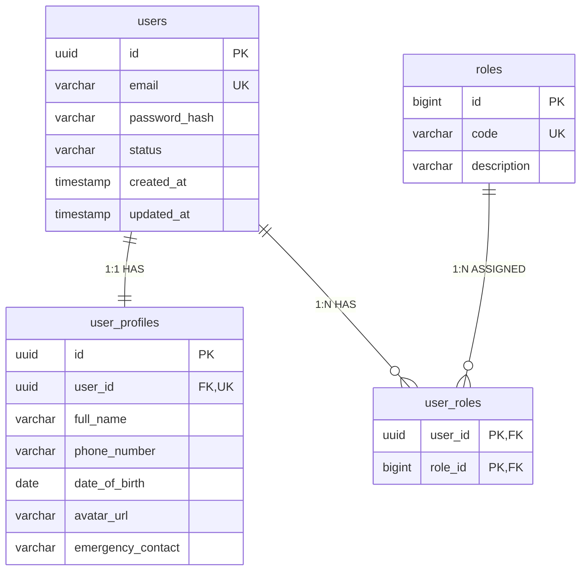
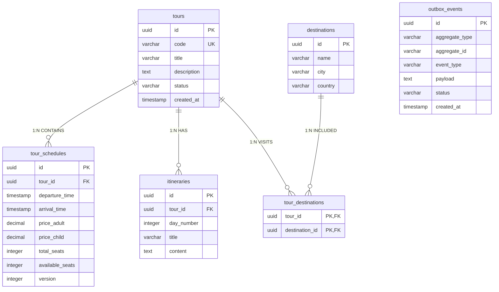
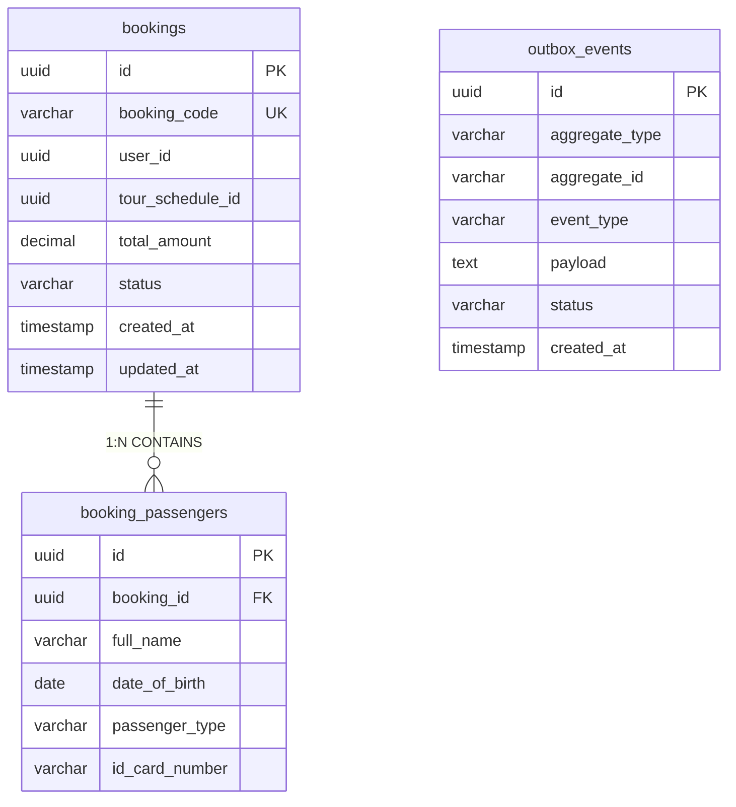
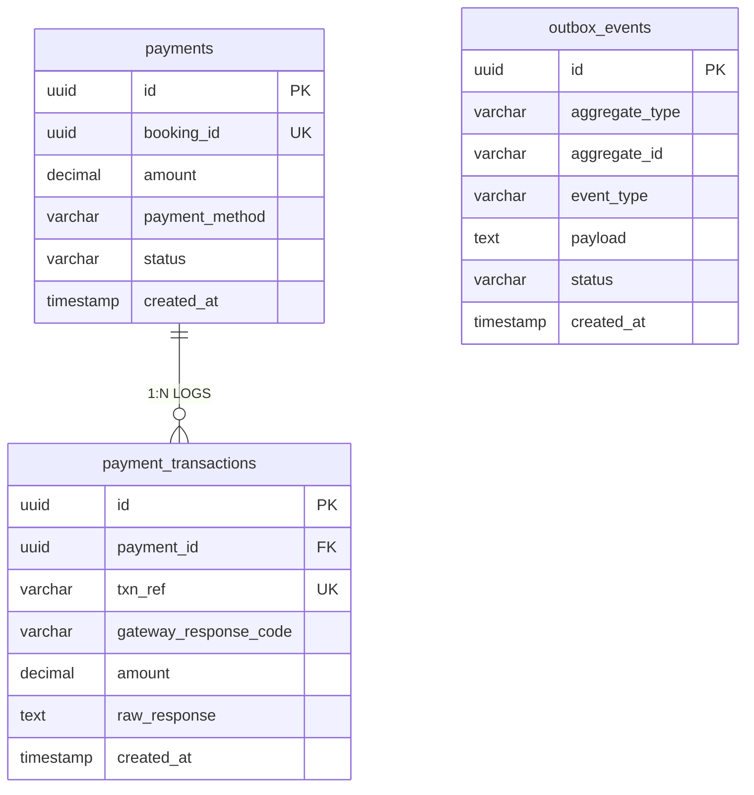
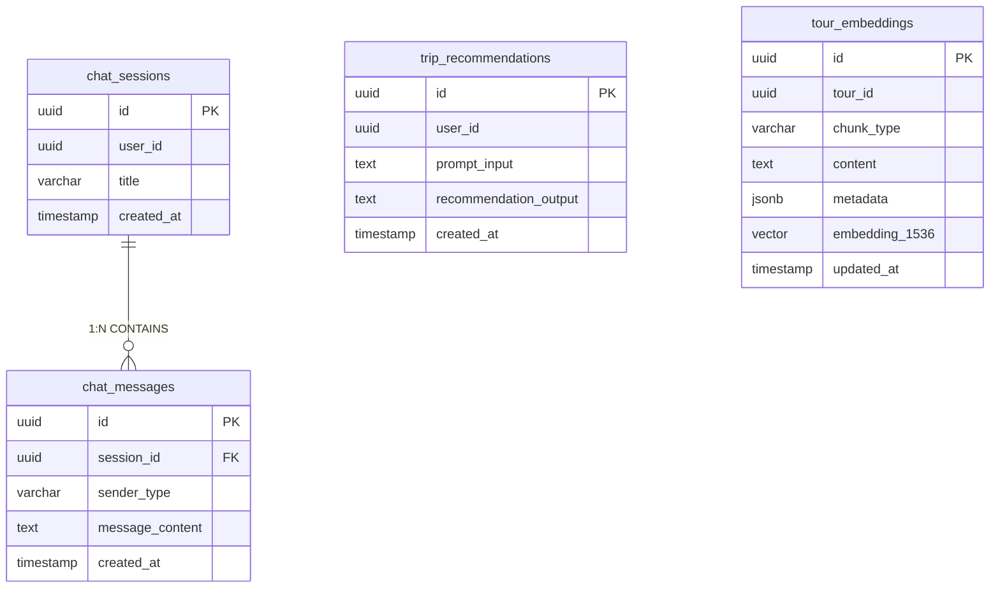

# BÁO CÁO THIẾT KẾ CƠ SỞ DỮ LIỆU & ERD (DATABASE ARCHITECTURE SPECIFICATION)
## HỆ THỐNG TRAVEL MICROSERVICES PLATFORM

---

> [!NOTE]
> Báo cáo này được lập bởi **Database Architect**, dựa trên thiết kế Domain Model từ [ddd_domain_model_spec.md](file:///C:/Users/Admin/.gemini/antigravity-ide/brain/8586db8d-201a-467f-96c9-218ddfdef14d/ddd_domain_model_spec.md) và Kiến trúc [architecture.md](file:///e:/Travel_Management/architecture.md). Tài liệu chuẩn hóa cấu trúc dữ liệu cho **5 Database PostgreSQL độc lập (Database-per-Service Pattern)** (**100% thuần thiết kế schema/ERD, không chứa code DDL**).

---

# I. THIẾT KẾ SCHEMA VÀ ERD TỪNG DATABASE

---

## 1. DATABASE: `db_travel_auth` (Auth Service - Port 5432)

### 1.1. Sơ đồ ERD (Mermaid Diagram)


### 1.2. Mổ xẻ Chi tiết Cột (Column Explanation) & Constraints

#### Bảng `users` (Tài khoản Đăng nhập)
* `id` (UUID, PK): Mã định danh duy nhất của tài khoản.
* `email` (VARCHAR(150), NOT NULL, UNIQUE): Email dùng làm tên đăng nhập. Constraint: Unique index.
* `password_hash` (VARCHAR(255), NOT NULL): Chuỗi mật khẩu đã băm (BCrypt/PBKDF2).
* `status` (VARCHAR(30), NOT NULL, DEFAULT 'ACTIVE'): Trạng thái tài khoản (`PENDING_APPROVAL`, `ACTIVE`, `BLOCKED`).
* `created_at`, `updated_at` (TIMESTAMP WITH TIME ZONE, NOT NULL): Thời gian tạo và cập nhật bản ghi.

#### Bảng `user_profiles` (Thông tin Hồ sơ)
* `id` (UUID, PK): Mã định danh hồ sơ.
* `user_id` (UUID, NOT NULL, FK, UNIQUE): Khóa ngoại tham chiếu đến `users(id)`. Constraint: Unique để đảm bảo quan hệ 1:1.
* `full_name` (VARCHAR(100), NOT NULL): Họ và tên đầy đủ.
* `phone_number` (VARCHAR(20), NULL): Số điện thoại liên hệ.
* `date_of_birth` (DATE, NULL): Ngày tháng năm sinh.
* `avatar_url` (VARCHAR(500), NULL): Đường dẫn ảnh đại diện lưu trên MinIO/S3.
* `emergency_contact` (VARCHAR(100), NULL): Số điện thoại / Thông tin người thân liên hệ khẩn cấp.

#### Bảng `roles` & `user_roles` (Phân quyền)
* `roles.code` (VARCHAR(50), NOT NULL, UNIQUE): Mã quyền (`ROLE_TOURIST`, `ROLE_GUIDE`, `ROLE_ADMIN`).
* `user_roles`: Bảng trung gian thể hiện quan hệ nhiều-nhiều (N:M). Khóa chính hợp phần (Composite PK: `user_id`, `role_id`).

### 1.3. Đề xuất Tối ưu hóa Index
* `idx_users_email` (B-Tree Unique): Tối ưu hóa tốc độ tra cứu khi người dùng đăng nhập bằng Email.
* `idx_users_status` (B-Tree Partial Index): Index các user có `status = 'PENDING_APPROVAL'` cho màn hình phê duyệt của Admin.

---

## 2. DATABASE: `db_travel_tour` (Tour Service - Port 5433)

### 2.1. Sơ đồ ERD (Mermaid Diagram)


### 2.2. Mổ xẻ Chi tiết Cột & Constraints

#### Bảng `tours` (Danh mục Tour)
* `id` (UUID, PK): Khóa chính Tour.
* `code` (VARCHAR(50), NOT NULL, UNIQUE): Mã danh mục Tour (ví dụ: `TOUR-DANANG-3N2D`).
* `title` (VARCHAR(250), NOT NULL): Tên tiêu đề Tour.
* `status` (VARCHAR(30), NOT NULL): Trạng thái (`DRAFT`, `PUBLISHED`, `ARCHIVED`).

#### Bảng `tour_schedules` (Lịch khởi hành & Giữ chỗ)
* `id` (UUID, PK): Khóa chính chuyến đi.
* `tour_id` (UUID, NOT NULL, FK): Tham chiếu `tours(id)`.
* `departure_time`, `arrival_time` (TIMESTAMP WITH TIME ZONE, NOT NULL): Thời gian khởi hành và kết thúc. Constraint: `CHECK (arrival_time > departure_time)`.
* `price_adult`, `price_child` (DECIMAL(12,2), NOT NULL): Giá vé. Constraint: `CHECK (price_adult > 0)`.
* `total_seats` (INTEGER, NOT NULL): Tổng số chỗ mở bán (`CHECK (total_seats > 0)`).
* `available_seats` (INTEGER, NOT NULL): Số chỗ còn lại. Constraint quan trọng: `CHECK (available_seats >= 0)`.
* `version` (INTEGER, NOT NULL, DEFAULT 0): Cột đánh dấu để áp dụng **Optimistic Locking** chống Race Condition khi trừ chỗ.

#### Bảng `outbox_events` (Transactional Outbox Pattern)
* `id` (UUID, PK): Mã sự kiện.
* `aggregate_type` (VARCHAR(50), NOT NULL): Loại Aggregate (`TOUR`).
* `aggregate_id` (VARCHAR(100), NOT NULL): ID của Aggregate.
* `event_type` (VARCHAR(100), NOT NULL): Mã sự kiện (`TourSeatsReservedEvent`).
* `payload` (TEXT/JSONB, NOT NULL): Dữ liệu sự kiện định dạng JSON.
* `status` (VARCHAR(20), NOT NULL, DEFAULT 'PENDING'): Trạng thái Outbox (`PENDING`, `PROCESSED`).

### 2.3. Đề xuất Tối ưu hóa Index
* `idx_tour_schedules_search` (Composite B-Tree): `(tour_id, departure_time, available_seats)` giúp tăng tốc độ tìm kiếm các chuyến đi còn chỗ trong khoảng thời gian chỉ định.
* `idx_schedules_available_seats` (Partial Index): `CREATE INDEX idx_schedules_available ON tour_schedules(id) WHERE available_seats > 0` giúp lọc nhanh các chuyến đi còn mở bán.
* `idx_outbox_status_created` (Composite Index): `(status, created_at)` cho Outbox Polling Task quét nhanh các bản tin `PENDING`.

---

## 3. DATABASE: `db_travel_booking` (Booking Service - Port 5434)

### 3.1. Sơ đồ ERD (Mermaid Diagram)


### 3.2. Mổ xẻ Chi tiết Cột & Constraints

#### Bảng `bookings` (Đơn đặt tour - Aggregate Root)
* `id` (UUID, PK): Khóa chính đơn hàng.
* `booking_code` (VARCHAR(20), NOT NULL, UNIQUE): Mã đơn hàng hiển thị cho khách (ví dụ: `BK20260804-X9A`).
* `user_id` (UUID, NOT NULL): Tham chiếu logic đến User bên Auth Service.
* `tour_schedule_id` (UUID, NOT NULL): Tham chiếu logic đến Chuyến đi bên Tour Service.
* `total_amount` (DECIMAL(12,2), NOT NULL): Tổng giá trị đơn hàng (`CHECK (total_amount > 0)`).
* `status` (VARCHAR(30), NOT NULL): Trạng thái đơn hàng (`PENDING`, `SEATS_RESERVED`, `PAYMENT_PENDING`, `CONFIRMED`, `CANCELLED`).

#### Bảng `booking_passengers` (Danh sách hành khách)
* `id` (UUID, PK): Khóa chính hành khách.
* `booking_id` (UUID, NOT NULL, FK): Tham chiếu `bookings(id) ON DELETE CASCADE`.
* `full_name` (VARCHAR(100), NOT NULL): Tên hành khách.
* `passenger_type` (VARCHAR(20), NOT NULL): Loại vé (`ADULT`, `CHILD`, `INFANT`).
* `id_card_number` (VARCHAR(30), NULL): Số CCCD hoặc Hộ chiếu.

### 3.3. Đề xuất Tối ưu hóa Index
* `idx_bookings_user_id` (B-Tree): Tối ưu truy vấn lịch sử đặt tour của du khách.
* `idx_bookings_status_timeout` (Composite Partial Index): `(status, created_at) WHERE status = 'PENDING'` phục vụ Cronjob quét tự động hủy các đơn hàng hết hạn 15 phút chưa thanh toán.

---

## 4. DATABASE: `db_travel_payment` (Payment Service - Port 5435)

### 4.1. Sơ đồ ERD (Mermaid Diagram)


### 4.2. Mổ xẻ Chi tiết Cột & Constraints

#### Bảng `payments` (Giao dịch Thanh toán chính)
* `id` (UUID, PK): Khóa chính thanh toán.
* `booking_id` (UUID, NOT NULL, UNIQUE): Tham chiếu logic đến Booking. Constraint Unique đảm bảo mỗi Booking chỉ có 1 bản ghi Payment chính.
* `amount` (DECIMAL(12,2), NOT NULL): Số tiền thanh toán (`CHECK (amount > 0)`).
* `payment_method` (VARCHAR(30), NOT NULL): Phương thức (`VNPAY`, `MOMO`, `STRIPE`).
* `status` (VARCHAR(30), NOT NULL): Trạng thái (`PENDING`, `SUCCESS`, `FAILED`, `REFUNDED`).

#### Bảng `payment_transactions` (Lịch sử Nỗ lực Giao dịch & Webhook)
* `id` (UUID, PK): Khóa chính bản ghi Log.
* `payment_id` (UUID, NOT NULL, FK): Tham chiếu `payments(id)`.
* `txn_ref` (VARCHAR(100), NOT NULL, UNIQUE): Mã tham chiếu duy nhất từ Cổng thanh toán (ví dụ: `vnp_TxnRef`).
* `gateway_response_code` (VARCHAR(20), NULL): Mã phản hồi cổng (ví dụ: `00` là thành công).
* `raw_response` (TEXT, NULL): Dữ liệu thô JSON/Payload nhận từ Webhook để phục vụ kiểm toán (Audit).

### 4.3. Đề xuất Tối ưu hóa Index
* `idx_payment_txn_ref` (B-Tree Unique): Tối ưu truy vấn cực nhanh khi Webhook IPN từ VNPAY/Stripe bắn sang tìm kiếm giao dịch theo `vnp_TxnRef`.
* `idx_payments_booking_id` (B-Tree Unique): Tìm thông tin thanh toán theo mã đơn hàng.

---

## 5. DATABASE: `db_travel_ai` (AI Service - Port 5436 - PostgreSQL + pgvector)

### 5.1. Sơ đồ ERD (Mermaid Diagram)


### 5.2. Mổ xẻ Chi tiết Cột & Constraints

#### Bảng `tour_embeddings` (Kho dữ liệu Vector cho RAG Semantic Search)
* `id` (UUID, PK): Khóa chính bản ghi Chunk Vector.
* `tour_id` (UUID, NOT NULL): Mã danh mục Tour liên quan.
* `chunk_type` (VARCHAR(50), NOT NULL): Loại phân đoạn (`METADATA` hoặc `ITINERARY_DAY`).
* `content` (TEXT, NOT NULL): Nội dung văn bản phân đoạn dùng để sinh Vector Embedding.
* `metadata` (JSONB, NULL): Chứa thông tin lọc cứng (như `tour_code`, `price`, `location`) cho Metadata Filtering trong RAG.
* `embedding_1536` (`vector(1536)`, NOT NULL): Tọa độ Vector Embedding 1536 chiều sinh bởi OpenAI `text-embedding-3-small`.

#### Bảng `chat_sessions` & `chat_messages` (Lịch sử Chatbot)
* `sender_type` (VARCHAR(20), NOT NULL): Người gửi (`USER`, `ASSISTANT`).
* `message_content` (TEXT, NOT NULL): Nội dung cuộc trò chuyện.

### 5.3. Đề xuất Tối ưu hóa Index Vector (pgvector Indexing)
* **HNSW Index (Hierarchical Navigable Small World):**
  ```sql
  -- Tối ưu tốc độ tìm kiếm hàng xóm gần nhất (Cosine Distance) cho RAG
  CREATE INDEX idx_tour_embeddings_hnsw 
  ON tour_embeddings 
  USING hnsw (embedding_1536 vector_cosine_ops)
  WITH (m = 16, ef_construction = 64);
  ```
* **Lợi ích:** HNSW Index giúp tìm kiếm khoảng cách Vector Cosine với thời gian phản hồi ở mức milisecond ($\le 10ms$), vượt trội so với tìm kiếm quét toàn bộ bảng (Exact Search).

---

# II. BẢNG TỔNG HỢP CHIẾN LƯỢC TỐI ƯU HÓA INDEX HỆ THỐNG

| Cơ sở Dữ liệu | Tên Index | Loại Index | Cột được Index | Mục đích Tối ưu |
| :--- | :--- | :--- | :--- | :--- |
| **db_travel_auth** | `idx_users_email` | B-Tree Unique | `email` | Tốc độ đăng nhập hệ thống ($O(\log N)$). |
| **db_travel_tour** | `idx_schedules_search` | B-Tree Composite | `(tour_id, departure_time, available_seats)` | Lọc chuyến đi còn chỗ khả dụng. |
| **db_travel_tour** | `idx_outbox_status` | B-Tree Composite | `(status, created_at)` | Tốc độ Outbox Polling Task quét tin nhắn. |
| **db_travel_booking** | `idx_bookings_timeout` | Partial B-Tree | `(status, created_at) WHERE status='PENDING'` | Quét tự động hủy đơn hàng hết hạn 15 phút. |
| **db_travel_payment** | `idx_payment_txn_ref` | B-Tree Unique | `txn_ref` | Tìm kiếm instant cho Webhook Callback IPN. |
| **db_travel_ai** | `idx_tour_hnsw` | HNSW Vector | `embedding_1536 vector_cosine_ops` | Tìm kiếm ngữ nghĩa RAG trong $\le 10ms$. |
