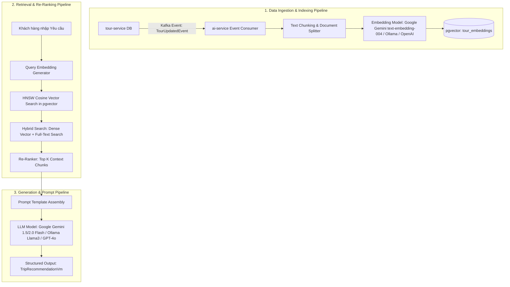
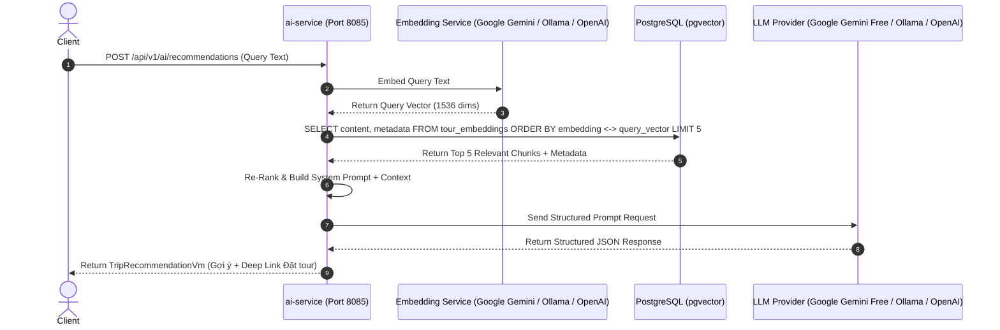

# THIẾT KẾ KIẾN TRÚC RAG AI (RETRIEVAL-AUGMENTED GENERATION)
## HỆ THỐNG TRAVEL MICROSERVICES PLATFORM (`ai-service`)

---

> [!NOTE]
> Tài liệu này được lập bởi **AI Systems Architect**, hướng dẫn chi tiết toàn bộ kiến trúc và luồng xử lý **RAG AI (Retrieval-Augmented Generation)** cho `ai-service` trong hệ thống Microservices du lịch, kết hợp Spring AI, PostgreSQL `pgvector` và LLM Model.

---

# I. TẠI SAO CẦN RAG VÀ TỔNG QUAN KIẾN TRÚC RAG DU LỊCH

### 1. Tại sao cần RAG trong Hệ thống Du lịch?
* **Khắc phục Lỗi Ảo giác (Hallucination):** LLM thương mại (như GPT-4, Llama) không biết thông tin nội bộ về các Tour du lịch cụ thể, lịch khởi hành thực tế hay bảng giá niêm yết của doanh nghiệp.
* **Cập nhật Dữ liệu Real-time:** Khi `tour-service` thêm tour mới hoặc đổi giá, RAG giúp AI trả lời chính xác ngay lập tức mà không cần Fine-tune lại mô hình LLM.
* **Liên kết Trực tiếp đến Đơn hàng:** RAG cho phép gắn kèm `tourId` và `scheduleId` thật trong bài tư vấn để khách hàng có thể bấm "Đặt tour ngay".

---

# II. 3 TIẾN TRÌNH CỐT LÕI TRONG KIẾN TRÚC RAG DU LỊCH



---

## 1. PIPELINE 1: BÁO CHẾ DỮ LIỆU & INDEXING (DATA INGESTION & VECTOR INDEXING)

### 1.1. Đồng bộ Dữ liệu Bất đồng bộ qua Kafka
* Khi `tour-service` tạo mới hoặc cập nhật Tour, một Event `TourUpdatedEvent` được bắn ra Kafka.
* `ai-service` tiêu thụ Event này để thực hiện tự động Indexing dữ liệu vào `pgvector` mà không làm chậm `tour-service`.

### 1.2. Chiến lược Phân đoạn Văn bản (Text Chunking Strategy)
* Không đưa nguyên toàn bộ Tour thành 1 đoạn text lớn.
* **Chiến lược Semantic Chunking:**
  * **Chunk 1 (Metadata Chunk):** Tên Tour, Điểm đến, Tổng số ngày đi, Mức giá, Đối tượng phù hợp (Gia đình/Cặp đôi/Phượt).
  * **Chunk 2..N (Itinerary Day Chunks):** Lịch trình chi tiết theo từng ngày (Ví dụ: "Ngày 1: Tham quan Chùa Linh Ứng - Tắm biển Mỹ Khê - Ăn tối hải sản").

### 1.3. Tạo Vector Embedding & Lưu vào `pgvector`
* Sử dụng **Spring AI `EmbeddingModel`**: Có thể kết nối linh hoạt tới **Google Gemini Free Tier** (`text-embedding-004` 768/1536 dims), **Local Ollama** (`nomic-embed-text` / `bge-m3`), hoặc **OpenAI** (`text-embedding-3-small` 1536 dims).
* Lưu bản ghi vào bảng `tour_embeddings` trong PostgreSQL với chỉ mục **HNSW Index** để truy vấn siêu tốc:
  ```sql
  -- Cấu trúc lưu trữ Vector trong db_travel_ai
  CREATE TABLE tour_embeddings (
      id UUID PRIMARY KEY,
      tour_id UUID NOT NULL,
      chunk_type VARCHAR(50), -- 'METADATA' hoặc 'ITINERARY_DAY'
      content TEXT NOT NULL,
      metadata JSONB, -- Lưu tour_code, price, location để filter
      embedding vector(1536) NOT NULL
  );
  ```

---

## 2. PIPELINE 2: TRUY VẤN NGỮ NGHĨA & LỌC TƯƠNG ĐỒNG (RETRIEVAL & RE-RANKING)

### 2.1. Mã hóa Yêu cầu Người dùng (Query Embedding)
* Khi du khách gõ: *"Tôi muốn đi du lịch 3 ngày 2 đêm tại nơi có biển đẹp, phù hợp cho trẻ em, giá dưới 5 triệu"*.
* `ai-service` gọi `EmbeddingModel` để biến câu thoại trên thành Vector $V_{query}$ (1536 chiều).

### 2.2. Tìm kiếm Hybrid (Hybrid Search Strategy)
Để đạt độ chính xác cao nhất, RAG kết hợp 2 kỹ thuật:
1. **Dense Vector Search (Cosine Similarity):** Tìm các tour có ý nghĩa tương đồng bằng HNSW Index trong `pgvector`:
   $$\text{Distance} = 1 - \frac{A \cdot B}{\|A\| \|B\|}$$
2. **Metadata Filtering (Hard Constraints):** Lọc cứng trước khi Vector Search (ví dụ: `metadata->>'price' <= 5000000`).

### 2.3. Tái Sắp Xếp Ngữ Cảnh (Re-Ranking)
* Chọn ra Top 10 đoạn văn bản (Chunks) có điểm Cosine cao nhất.
* Sử dụng bộ **Re-Ranker (Cohere Rerank / Spring AI Advisor)** để đánh giá lại tính liên quan thực sự với câu hỏi, chọn ra Top 3-5 Chunks chuẩn nhất để đưa vào Prompt.

---

## 3. PIPELINE 3: SINH CÂU TRẢ LỜI & PROMPT ENGINEERING (GENERATION)

### 3.1. Thiết kế Prompt Template (Prompt Assembly)
Spring AI sẽ tự động dựng Prompt theo mẫu chuẩn chống ảo giác:

```text
[SYSTEM INSTRUCTION]
Bạn là Trợ lý AI Du lịch chuyên nghiệp của hệ thống Travel Platform.
Nhiệm vụ của bạn là tư vấn lịch trình du lịch dựa CHỈ TRÊN DỮ LIỆU ĐƯỢC CUNG CẤP dưới đây.
TUYỆT ĐỐI KHÔNG tự sáng tạo ra các Tour hoặc giá vé không có trong ngữ cảnh.
Nếu dữ liệu không đủ đáp ứng, hãy lịch sự thông báo cho khách hàng.

[CONTEXT DATA FROM VECTOR DB]
---
Chunk 1: Tour Đà Nẵng - Hội An 3N2Đ (ID: 9b1deb4d-3b7d-4bad-9bdd-2b0d7b3dcb6d)
Giá: 4,500,000 VNĐ. Phù hợp gia đình có trẻ em.
Lịch trình: Ngày 1 (Bà Nà Hills), Ngày 2 (Phố cổ Hội An), Ngày 3 (Biển Mỹ Khê).
---
Chunk 2: Tour Nha Trang 3N2Đ (ID: 3a2c4e... )
Giá: 4,800,000 VNĐ. 
...

[USER QUERY]
Tôi muốn đi du lịch 3 ngày 2 đêm tại nơi có biển đẹp, phù hợp cho trẻ em, giá dưới 5 triệu.

[OUTPUT FORMAT REQUIREMENT]
Trả về bài tư vấn định dạng JSON chuẩn gồm:
- introduction: Lời chào và tóm tắt.
- recommended_tours: Danh sách các Tour được chọn (bao gồm tourId, title, price, reason).
- detailed_itinerary: Lịch trình gợi ý theo từng ngày.
```

### 3.2. Cấu trúc Trả về Chuẩn hóa (Structured Output)
`ai-service` sử dụng `BeanOutputConverter` của Spring AI để ép kiểu LLM trả về trực tiếp DTO `TripRecommendationVm` để Frontend hiển thị UI đẹp mắt:

```json
{
  "introduction": "Dựa trên yêu cầu của bạn, tôi xin gợi ý Tour Đà Nẵng - Hội An 3N2Đ rất thích hợp cho gia đình có trẻ nhỏ với mức giá dưới 5 triệu VNĐ.",
  "recommended_tours": [
    {
      "tour_id": "9b1deb4d-3b7d-4bad-9bdd-2b0d7b3dcb6d",
      "title": "Tour Đà Nẵng - Ba Na Hills - Hội An 3N2Đ",
      "price": 4500000,
      "booking_url": "/tours/9b1deb4d-3b7d-4bad-9bdd-2b0d7b3dcb6d"
    }
  ],
  "detailed_itinerary": [
    {"day": 1, "activity": "Vui chơi tại Bà Nà Hills và Công viên Fantasy Park cho bé."},
    {"day": 2, "activity": "Tham quan Phố cổ Hội An và thưởng thức ẩm thực."},
    {"day": 3, "activity": "Tắm biển Mỹ Khê và mua sắm quà lưu niệm."}
  ]
}
```

---

# III. SƠ ĐỒ TUẦN TỰ RAG THỰC TẾ (RAG SEQUENCE FLOW)



---

# IV. NGUYÊN TẮC BẢO VỆ & TỐI ƯU HÓA RAG TRONG THỰC TẾ (GUARDRAILS & OPTIMIZATION)

1. **Chống Trôi Dữ liệu (Drift Guardrail):** Khi `tour-service` cập nhật giá hoặc sửa thông tin Tour, phải xoá/cập nhật ngay Chunk Vector cũ trong `db_travel_ai` để tránh AI tư vấn theo giá cũ.
2. **Caching Câu hỏi Phổ biến (Semantic Caching):** Sử dụng Redis lưu lại cặp `(Query Vector, LLM Response)` cho các câu hỏi phổ biến (ví dụ: *"Các tour đi Đà Nẵng giá rẻ"*). Nếu câu hỏi mới có độ tương đồng Vector $\ge 0.95$ với câu hỏi cũ trong Cache $\rightarrow$ Trả về kết quả ngay mà không cần gọi LLM, tiết kiệm 90% chi phí API / Quota.
3. **Giới hạn Rate Limit:** Áp dụng Hạn mức (Quota Limit) theo `userId` (ví dụ: Tối đa 20 lượt gọi AI RAG / ngày đối với tài khoản thường) để tránh bị lạm dụng API AI hoặc vượt quá Free Tier Quota của Gemini/Ollama.
4. **Tính Độc Lập Provider (Provider Agnostic):** Kiến trúc RAG cho phép chuyển đổi linh hoạt giữa các LLM Provider (Google Gemini Free Tier, Ollama Local 0 đồng, hoặc OpenAI) chỉ bằng cách đổi cấu hình `application.yml` trong `ai-service` mà không cần viết lại logic code.
