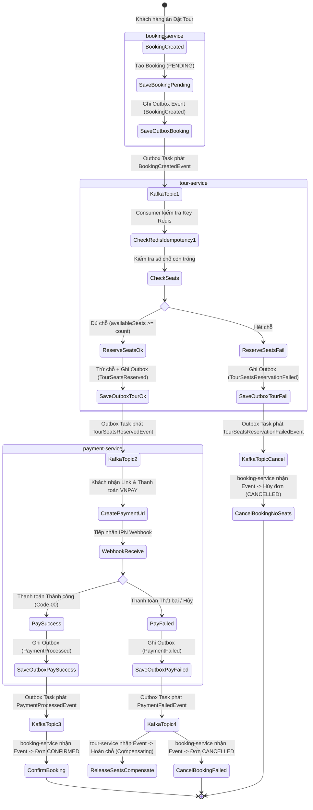
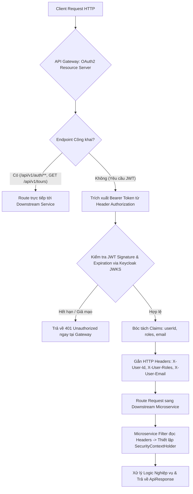
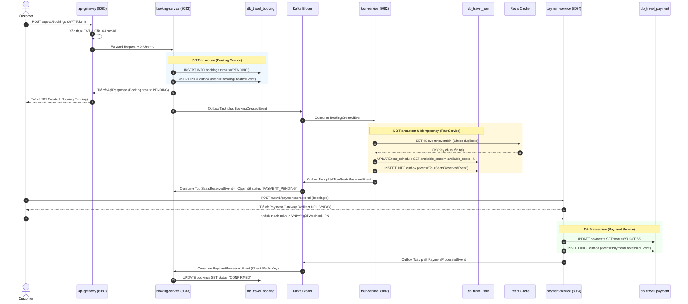
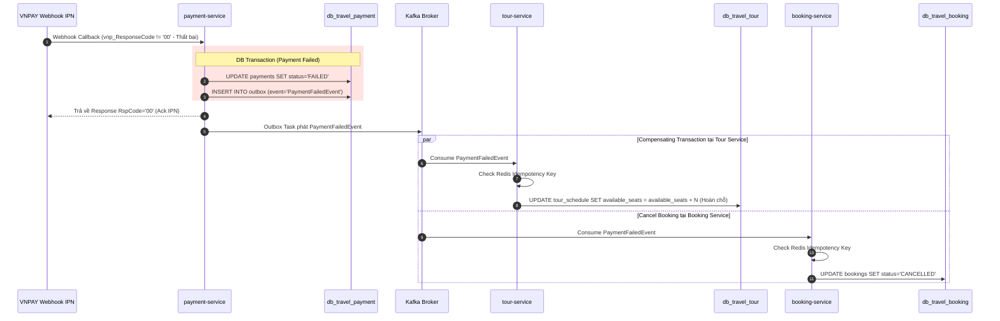
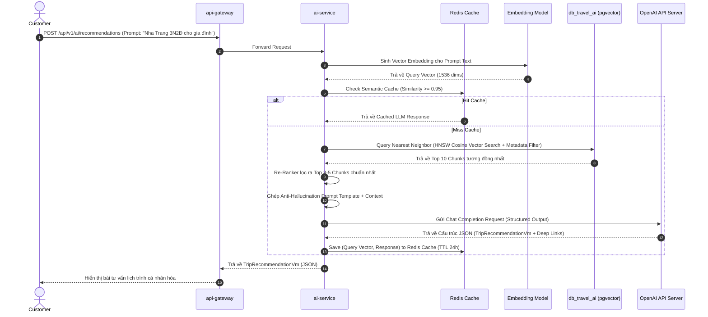

# BÁO CÁO THIẾT KẾ HỆ THỐNG (SYSTEM ANALYSIS SPECIFICATION)
## HỆ THỐNG TRAVEL MICROSERVICES PLATFORM

---

> [!NOTE]
> Báo cáo này được lập bởi **System Analyst (SA)**, dựa trên các Quy tắc Nghiệp vụ (Business Rules) từ [business_analysis_spec.md](file:///C:/Users/Admin/.gemini/antigravity-ide/brain/8586db8d-201a-467f-96c9-218ddfdef14d/business_analysis_spec.md) và Kiến trúc Kỹ thuật [architecture.md](file:///e:/Travel_Management/architecture.md). Document này phân định rõ trách nhiệm hệ thống, Use Case, Activity Flow và Sequence Flow không chứa code triển khai.

---

# I. MA TRẬN PHÂN ĐỊNH TRÁCH NHIỆM DỊCH VỤ (SERVICE RESPONSIBILITY MATRIX)

| Microservice | Bounded Context & Trách nhiệm chính | Database Sở hữu | Event Phát đi (Publish) | Event Tiếp nhận (Consume) |
| :--- | :--- | :--- | :--- | :--- |
| **api-gateway** | - Kiểm tra & Xác thực JWT Token tập trung (OAuth2 Resource Server).<br>- Định tuyến Traffic và bóc tách Header (`X-User-Id`, `X-User-Roles`). | Không | Không | Không |
| **auth-service** | - Quản lý User Profile, Role & Phân quyền.<br>- Tích hợp Keycloak Admin Client để tạo/xác thực tài khoản. | `db_travel_auth`<br>(User, Role, Profile) | `UserRegisteredEvent`<br>`UserUpdatedEvent` | Không |
| **tour-service** | - Quản lý danh mục Tour, điểm đến, lịch trình và số chỗ trống.<br>- Thực hiện trừ chỗ / hoàn chỗ bất đồng bộ cho luồng Saga. | `db_travel_tour`<br>(Tour, Schedule, Itinerary, Outbox) | `TourSeatsReservedEvent`<br>`TourSeatsReservationFailedEvent`<br>`TourSeatsReleasedEvent` | `BookingCreatedEvent`<br>`PaymentFailedEvent`<br>`BookingCancelledEvent` |
| **booking-service** | - Quản lý vòng đời Booking (PENDING $\rightarrow$ CONFIRMED/CANCELLED).<br>- Khởi xướng luồng Saga và lưu vết Outbox Event. | `db_travel_booking`<br>(Booking, Passenger, Outbox) | `BookingCreatedEvent`<br>`BookingCancelledEvent` | `TourSeatsReservedEvent`<br>`TourSeatsReservationFailedEvent`<br>`PaymentProcessedEvent`<br>`PaymentFailedEvent` |
| **payment-service** | - Khởi tạo liên kết thanh toán (VNPAY, MOMO, Stripe).<br>- Tiếp nhận Webhook IPN và xử lý hoàn tiền (Refund). | `db_travel_payment`<br>(Payment, Transaction, Outbox) | `PaymentProcessedEvent`<br>`PaymentFailedEvent`<br>`PaymentRefundedEvent` | `TourSeatsReservedEvent`<br>`BookingCancelledEvent` |
| **ai-service** | - AI Assistant tư vấn lịch trình (Spring AI + RAG).<br>- Chatbot tương tác và Tìm kiếm Ngữ nghĩa (pgvector). | `db_travel_ai`<br>(Recommendation, Chat, Vector DB) | Không | `TourUpdatedEvent` (Cập nhật Embedding) |

---

# II. DANH SÁCH & GIẢI THÍCH CHI TIẾT CÁC USE CASE (USE CASE SPECIFICATIONS)

---

### UC-AUTH-01: Đăng ký & Kích hoạt Tài khoản (User Registration)
* **Mô tả System:** Hệ thống tiếp nhận thông tin từ Client, gọi Keycloak để tạo User Security Entity, sau đó tạo bản ghi Profile trong Database nội bộ của Auth Service.
* **Actors:** Tourist, Tour Guide.
* **Trigger:** Người dùng gửi `POST /api/v1/auth/register`.
* **System Inputs:** `email`, `password`, `fullName`, `phoneNumber`, `accountType`.
* **System Outputs:** `201 Created` kèm `UserVm` (UserId, Email, Status).
* **Luồng xử lý hệ thống:**
  1. `api-gateway` chuyển tiếp request công khai sang `auth-service`.
  2. `auth-service` kiểm tra trùng lặp email/sĐT trong `db_travel_auth`.
  3. `auth-service` gọi REST API tới Keycloak Admin Server để tạo User credentials.
  4. Sau khi Keycloak tạo thành công, `auth-service` tạo bản ghi `UserProfile` với `status = ACTIVE` (hoặc `PENDING_APPROVAL` đối với Hướng dẫn viên).

---

### UC-AUTH-02: Đăng nhập & Cấp JWT Token (User Authentication)
* **Mô tả System:** Xác thực người dùng qua Keycloak Identity Provider và trả về cặp Token chứa các Claims đã được mã hóa chữ ký số.
* **Actors:** Tất cả người dùng.
* **Trigger:** Gửi `POST /api/v1/auth/login`.
* **System Inputs:** `username`, `password`.
* **System Outputs:** `200 OK` kèm `AuthTokenVm` (`accessToken`, `refreshToken`, `expiresIn`).
* **Luồng xử lý hệ thống:**
  1. `auth-service` chuyển request sang Keycloak OpenID Connect Token Endpoint.
  2. Keycloak xác thực credentials, mã hóa `userId`, `roles`, `email` vào JWT Token với chữ ký RSA Private Key.
  3. `auth-service` nhận kết quả từ Keycloak và trả về cho Client.

---

### UC-GATEWAY-01: Gateway JWT Authentication & Claim Forwarding
* **Mô tả System:** API Gateway acting as OAuth2 Resource Server đóng vai trò bảo vệ hệ thống ngay tại cửa ngõ.
* **Actors:** Hệ thống API Gateway.
* **Trigger:** Mọi HTTP Request gửi tới các Endpoint yêu cầu bảo mật (ví dụ: `/api/v1/bookings/**`).
* **System Inputs:** Header `Authorization: Bearer <JWT_TOKEN>`.
* **System Outputs:** Tiếp nhận & Forward sang downstream service kèm Header `X-User-Id`, `X-User-Roles` HOẶC Chặn với HTTP `401/403`.
* **Luồng xử lý hệ thống:**
  1. Gateway chặn Request tại `OAuth2ResourceServer` Filter.
  2. Gateway gọi Keycloak JWKS Endpoint (hoặc dùng Public Key cached) để kiểm tra chữ ký Token và Expiration Date.
  3. Nếu Token sai/hết hạn: Gateway hủy request và trả về `401 Unauthorized`.
  4. Nếu Token hợp lệ: Gateway bóc tách `sub` (userId) và `realm_access.roles` (roles), gắn vào Header `X-User-Id`, `X-User-Roles` rồi route request đến Downstream Service.

---

### UC-TOUR-01: Quản lý Tour & Lịch khởi hành (Tour Catalog Management)
* **Mô tả System:** Quản trị viên khởi tạo hoặc cập nhật thông tin danh mục Tour và số chỗ của chuyến đi.
* **Actors:** Admin.
* **Trigger:** Gửi `POST /api/v1/tours` hoặc `POST /api/v1/tours/{id}/schedules`.
* **System Inputs:** Dữ liệu Tour DTO, Lịch trình, Giá vé, Total Seats.
* **System Outputs:** `TourDetailVm` hoặc `TourScheduleVm`.
* **Luồng xử lý hệ thống:**
  1. Gateway xác thực Token có `ROLE_ADMIN` $\rightarrow$ Forward request sang `tour-service`.
  2. `tour-service` lưu Tour (Aggregate Root) và các entity con (`Itinerary`, `TourSchedule`) vào `db_travel_tour`.

---

### UC-TOUR-02: Giữ chỗ Tạm thời qua Outbox Event (Reserve Seats - Saga Participant)
* **Mô tả System:** Xử lý trừ chỗ bất đồng bộ khi nhận Event từ Kafka, áp dụng Transactional Outbox Pattern.
* **Actors:** Hệ thống Kafka (Event-Driven).
* **Trigger:** Kafka Consumer nhận `BookingCreatedEvent`.
* **System Inputs:** `eventId`, `bookingId`, `tourScheduleId`, `passengerCount`.
* **System Outputs:** Event `TourSeatsReservedEvent` hoặc `TourSeatsReservationFailedEvent` lưu vào bảng `outbox`.
* **Luồng xử lý hệ thống:**
  1. Consumer dùng `common-kafka` kiểm tra `eventId` trên Redis (`SETNX event:<eventId>`). Nếu đã xử lý $\rightarrow$ Ack và dừng.
  2. Mở DB Transaction trên `db_travel_tour`:
     - Kiểm tra `availableSeats` của `TourSchedule`.
     - Nếu `availableSeats >= passengerCount`: Trừ chỗ (`availableSeats -= passengerCount`), tạo Event `TourSeatsReservedEvent` ghi vào bảng `outbox`.
     - Nếu không đủ chỗ: Tạo Event `TourSeatsReservationFailedEvent` ghi vào bảng `outbox`.
  3. Outbox Task quét `outbox` và phát Event lên Kafka topic.

---

### UC-BOOK-01: Khởi tạo Đơn Đặt Tour (Create Booking - Saga Initiator)
* **Mô tả System:** Khách hàng khởi tạo đơn đặt tour, hệ thống lưu Booking và Event Outbox trong 1 Transaction nguyên tố.
* **Actors:** Tourist.
* **Trigger:** Gửi `POST /api/v1/bookings`.
* **System Inputs:** `tourScheduleId`, `passengers` list, `X-User-Id` (Header).
* **System Outputs:** `201 Created` kèm `BookingVm` (Status = PENDING).
* **Luồng xử lý hệ thống:**
  1. Client gửi request qua Gateway $\rightarrow$ Gateway gắn `X-User-Id` $\rightarrow$ Forward đến `booking-service`.
  2. `booking-service` tính tổng tiền.
  3. Mở DB Transaction trên `db_travel_booking`:
     - Lưu `Booking` (status = `PENDING`) và danh sách `BookingPassenger`.
     - Lưu `BookingCreatedEvent` vào bảng `outbox`.
  4. Commit Transaction và trả về `BookingVm` cho Client.
  5. Task Outbox đọc bảng `outbox` và phát `BookingCreatedEvent` sang Kafka.

---

### UC-BOOK-02: Xử lý Chuyển đổi Trạng thái Saga (Booking Saga State Handler)
* **Mô tả System:** Cập nhật trạng thái đơn hàng dựa trên phản hồi bất đồng bộ từ các service liên quan.
* **Actors:** Hệ thống Kafka.
* **Trigger:** Tiêu thụ các Event: `TourSeatsReservedEvent`, `PaymentProcessedEvent`, `PaymentFailedEvent`.
* **System Inputs:** `eventId`, `bookingId`, `status`.
* **System Outputs:** Cập nhật trạng thái trong `db_travel_booking`.
* **Luồng xử lý hệ thống:**
  1. Kiểm tra Redis Idempotency Key.
  2. Nếu nhận `TourSeatsReservedEvent`: Cập nhật trạng thái Booking $\rightarrow$ `PAYMENT_PENDING`.
  3. Nếu nhận `PaymentProcessedEvent`: Cập nhật trạng thái Booking $\rightarrow$ `CONFIRMED`.
  4. Nếu nhận `PaymentFailedEvent` hoặc `TourSeatsReservationFailedEvent`: Cập nhật trạng thái Booking $\rightarrow$ `CANCELLED`.

---

### UC-PAY-01: Khởi tạo Liên kết Thanh toán (Initiate Payment Session)
* **Mô tả System:** Tạo giao dịch thanh toán và sinh URL chuyển hướng tới cổng thanh toán VNPAY/Stripe.
* **Actors:** Tourist.
* **Trigger:** Gửi `POST /api/v1/payments/create-url`.
* **System Inputs:** `bookingId`, `paymentGateway` (VNPAY/MOMO/STRIPE).
* **System Outputs:** `PaymentUrlVm` (chứa URL thanh toán thứ 3).
* **Luồng xử lý hệ thống:**
  1. `payment-service` kiểm tra đơn hàng từ `booking-service` (qua OpenFeign hoặc cached event).
  2. Tạo bản ghi `Payment` (status = `PENDING`) trong `db_travel_payment`.
  3. Sinh Checksum SHA512 và tạo Payment Redirect URL từ Cổng thanh toán.

---

### UC-PAY-02: Tiếp nhận Webhook IPN Thanh toán (Payment Webhook Handler)
* **Mô tả System:** Xử lý kết quả giao dịch từ VNPAY/Stripe, phát Event để hoàn tất luồng Saga.
* **Actors:** VNPAY / Stripe Server (Webhook IPN).
* **Trigger:** Callback HTTP POST/GET từ Cổng thanh toán.
* **System Inputs:** `vnp_ResponseCode`, `vnp_TxnRef`, `vnp_SecureHash`, v.v.
* **System Outputs:** Response JSON xác nhận IPN (`{"RspCode":"00"}`).
* **Luồng xử lý hệ thống:**
  1. `payment-service` kiểm tra chữ ký Secure Hash. Nếu không khớp $\rightarrow$ Trả về lỗi checksum.
  2. Mở DB Transaction trên `db_travel_payment`:
     - Nếu thanh toán thành công (Code 00): Đổi Payment status $\rightarrow$ `SUCCESS`, ghi `PaymentProcessedEvent` vào bảng `outbox`.
     - Nếu thất bại: Đổi Payment status $\rightarrow$ `FAILED`, ghi `PaymentFailedEvent` vào bảng `outbox`.
  3. Task Outbox phát Event lên Kafka topic.

---

### UC-AI-01: Gợi ý Lịch trình Du lịch Thông minh (Smart RAG Recommendation)
* **Mô tả System:** Kết hợp truy vấn Vector Database và LLM Prompting để tạo tư vấn lịch trình cá nhân hóa.
* **Actors:** Tourist, Guest.
* **Trigger:** Gửi `POST /api/v1/ai/recommendations`.
* **System Inputs:** `promptText` (Yêu cầu địa điểm, ngân sách, số ngày đi).
* **System Outputs:** `TripRecommendationVm` (Lịch trình gợi ý + Danh sách Tour liên quan).
* **Luồng xử lý hệ thống:**
  1. `ai-service` chuyển `promptText` thành Vector Embedding qua Embedding Model.
  2. Truy vấn `db_travel_ai` (pgvector) bằng kỹ thuật Cosine Similarity để lấy các đoạn văn bản Tour/Điểm đến liên quan nhất.
  3. Tổng hợp Context thu được và dựng Prompt chuẩn gửi sang LLM (OpenAI API).
  4. Phân tích kết quả từ LLM và trả về bài tư vấn hoàn chỉnh.

---

# III. SƠ ĐỒ LUỒNG TIẾN TRÌNH NGHIỆP VỤ (ACTIVITY FLOWS)

### 1. Activity Flow: Luồng Đặt Tour & Thanh toán Saga (End-to-End Saga Workflow)



---

### 2. Activity Flow: Luồng Xác thực Tập trung tại API Gateway (Gateway JWT Flow)



---

# IV. SƠ ĐỒ TUẦN TỰ HỆ THỐNG (SEQUENCE FLOWS)

---

### Sequence Flow 1: Luồng Choreography Saga Đặt Tour Thành Công (Outbox + Idempotency)



---

### Sequence Flow 2: Luồng Giao Dịch Bù Hủy Đơn khi Thanh Toán Thất Bại (Saga Compensation Flow)



---

### Sequence Flow 3: Luồng Tư vấn Lịch trình Du lịch AI (AI Smart RAG Flow & Semantic Cache)



---

### Sequence Flow 4: Luồng Báo Chế Vector Embedding Bất Đồng Bộ qua Kafka (Async RAG Ingestion)

```mermaid
sequenceDiagram
    autonumber
    participant TS as tour-service
    participant K as Kafka Broker
    participant AI as ai-service
    participant Chunk as Document Splitter
    participant Emb as Embedding Model
    participant VDB as db_travel_ai (pgvector HNSW)

    TS->>K: Phát TourUpdatedEvent (Khi Tour được tạo/sửa)
    K->>AI: Consume TourUpdatedEvent
    AI->>AI: Check Redis Idempotency Key (event:<eventId>)
    AI->>Chunk: Phân đoạn Semantic Chunking (Metadata Chunk & Daily Itinerary Chunks)
    Chunk-->>AI: Danh sách text chunks
    loop Cho từng Chunk
        AI->>Emb: Sinh Vector Embedding (1536 dims)
        Emb-->>AI: Return Vector
        AI->>VDB: UPSERT INTO tour_embeddings (id, tour_id, content, embedding_1536)
    end
    VDB-->>AI: Cập nhật Vector DB thành công (HNSW Index auto-update)
```,StartLine:347,TargetContent:
